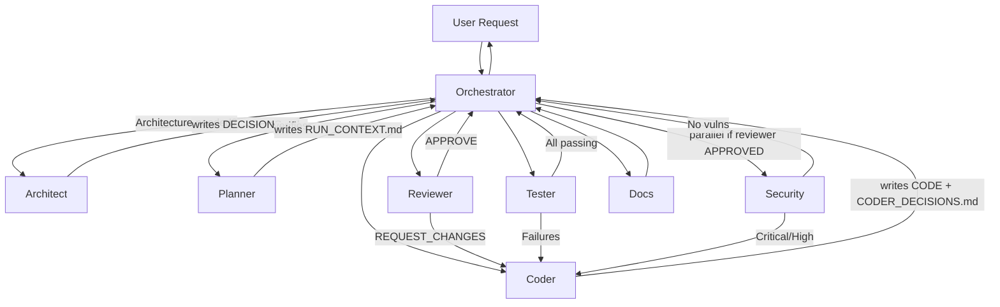

# OpenCode Multi-Agent System

A comprehensive template for setting up an OpenCode multi-agent development team. Structured workflows, clear roles, and best practices for coordinated AI-assisted development.

## How It Works

The system simulates a small development team with specialized agents. The **Orchestrator** coordinates the process — it analyzes requests, decides which agent to invoke next, verifies results, and ensures quality at each step.



## Quick Start

1. **Clone** this repository to your project
2. **Fill PROJECT_CONTEXT.md** — your tech stack, architecture rules, prohibitions
3. **Run OpenCode** — the orchestrator agent starts automatically

No additional installation needed. Agent configs load from `.opencode/` directory.

## Agents

| Agent | Role | Writes to | Permissions |
|-------|------|-----------|-------------|
| **Orchestrator** | Coordinates workflow, verifies results | — (verifies only) | Reads everything, delegates tasks, asks user questions |
| **Architect** | Architecture decisions, module boundaries | `DECISIONS.md` | Edit files, read git, web search |
| **Planner** | Step-by-step implementation plans | `RUN_CONTEXT.md` | Edit files, read git, web search |
| **Coder** | Implements features, fixes bugs | `CODER_DECISIONS.md` + code | Full edit + bash (no `rm`, no `git push`), web search |
| **Reviewer** | Code quality review | — (verdict only) | Read-only, web fetch for standards |
| **Tester** | Writes and fixes tests | — | Full edit + bash (no `rm`, no `git push`), web fetch |
| **Security** | Vulnerability scanning | — (report only) | Read-only, web search for CVEs |
| **Docs** | Documentation, CHANGELOG, JSDoc | — | Edit files, web fetch |

### Key Design Principles

- **Orchestrator never writes** — it verifies that agents wrote to memory files
- **Each agent reads project memory** before work: `DECISIONS.md`, `RUN_CONTEXT.md`, `CODER_DECISIONS.md`
- **Every agent has Output Format** — structured responses so Orchestrator can route correctly
- **`git push` is user-only** — no agent can push to remote
- **Least privilege** — each agent only has permissions it needs

## Memory System

Three-level memory ensures consistency across sessions:

| File | Who Writes | What's Inside |
|------|-----------|---------------|
| `DECISIONS.md` | Architect | Permanent architectural decisions (priority override) |
| `RUN_CONTEXT.md` | Planner | Current task context, plan, progress |
| `docs/CODER_DECISIONS.md` | Coder | Technical decisions, rejected approaches, workarounds |

**Priority:** `AGENTS.md` → `PROJECT_CONTEXT.md` → `DECISIONS.md` → `RUN_CONTEXT.md`

All agents read these files before starting work. If an agent violates a decision — Orchestrator sends it back.

## Workflows

| Task Type | Workflow | When Architect? |
|-----------|----------|-----------------|
| New Feature | architect → planner → coder → reviewer → tester → security → docs | ✅ Always |
| Bug Fix | planner → coder → tester → reviewer → security → docs | ❌ Skip |
| Documentation | docs → reviewer (optional) | ❌ Skip |
| Architecture Discussion | architect → docs | ✅ Always |

### Iterative Loop

When an agent finds issues, it doesn't proceed to the next step:

```
Reviewer → issues → Coder fixes → Reviewer checks again
Tester → failures → Coder fixes → Tester checks again  
Security → vulnerabilities → Coder fixes → Security checks again
```

Maximum 3 retries per agent per issue, then escalation to Orchestrator.

### Parallel Execution

Reviewer and Security can run **in parallel** — but only if Reviewer has **APPROVED** the code. If Reviewer requests changes, Security must wait.

## Permissions (opencode.json)

Agent permissions follow least-privilege principle:

| Agent | edit | bash | task | webfetch | websearch | question | skill |
|-------|------|------|------|----------|-----------|----------|-------|
| orchestrator | deny | deny | ✅ all | ✅ | ✅ | ✅ | ✅ |
| planner | ✅ | git read only | — | ✅ | ✅ | — | ✅ |
| architect | ✅ | git read only | — | ✅ | ✅ | — | ✅ |
| coder | ✅ | ✅ (no rm, no push) | — | ✅ | ✅ | — | ✅ |
| reviewer | deny | git read only | — | ✅ | — | — | ✅ |
| tester | ✅ | ✅ (no rm, no push) | — | ✅ | — | — | ✅ |
| security | deny | git read only | — | ✅ | ✅ | — | ✅ |
| docs | ✅ | deny | — | ✅ | — | — | ✅ |

Global rules:
- `git push` is **denied for all agents** — only the user can push
- `rm` and `rm -rf` are denied for coder and tester
- Only Orchestrator can invoke subagents via `task`

## Project Structure

```
project-root/
├── AGENTS.md                    # Universal rules and workflow (don't modify casually)
├── PROJECT_CONTEXT.md           # YOUR PROJECT — fill this first!
├── DECISIONS.md                 # Permanent architectural decisions
├── RUN_CONTEXT.md               # Current task context
├── opencode.json                # Agent permissions and models
├── docs/
│   ├── CODER_DECISIONS.md       # Technical decisions and workarounds
│   └── README.md                # This documentation
└── .opencode/
    ├── agents/
    │   ├── orchestrator.md       # Team coordinator
    │   ├── architect.md          # Architecture expert
    │   ├── planner.md            # Implementation planner
    │   ├── coder.md              # Code implementer
    │   ├── reviewer.md           # Code quality reviewer
    │   ├── tester.md             # Test specialist
    │   ├── security.md           # Security scanner
    │   └── docs.md               # Documentation writer
    └── workflows/
        └── feature-development.md
```

## Configuration

### Before Using

1. **Fill `PROJECT_CONTEXT.md`** — your tech stack, architecture principles, prohibitions, and directory structure
2. **Review `opencode.json`** — check model and permissions
3. **Review agent prompts** in `.opencode/agents/` — customize if needed

### Model Selection

Model is configured globally in `opencode.json`. All agents inherit this model automatically:

```json
{
  "model": "opencode-go/minimax-m2.5"
}
```

Change the model to any provider supported by OpenCode:

```json
{
  "model": "anthropic/claude-sonnet-4-20250514"
}
```

To override the model for a specific agent (e.g., use a faster model for reviewer), add `model` to that agent's config:

```json
{
  "agent": {
    "reviewer": {
      "model": "anthropic/claude-haiku-4-20250514"
    }
  }
}
```

Model recommendations:
- Orchestrator needs a strong model for coordination and routing
- Coder/Tester need strong models for code generation
- Reviewer/Security can use faster models for analysis
- Docs can use a balanced model

### Adding Skills

Skills are local instruction files that agents load on-demand:

```
.opencode/skills/<skill-name>/SKILL.md
```

Create a skill:

```markdown
---
name: git-release
description: Create consistent releases and changelogs
---

## What I do
- Draft release notes from merged PRs
- Propose a version bump

## When to use me
Use this when preparing a tagged release.
```

Agents see available skills and load them when relevant.

## Status Primitives

The 5 Laws of Code (enforced by Coder and Reviewer):

1. **Early Exit** — Guard clauses at function top, shallow nesting
2. **Parse, Don't Validate** — Parse once at boundaries, trust internally
3. **Atomic Predictability** — Pure functions where possible, explicit side effects
4. **Fail Fast** — Descriptive errors, no silent failures
5. **Intentional Naming** — Code reads like English, no cryptic abbreviations

## License

MIT
